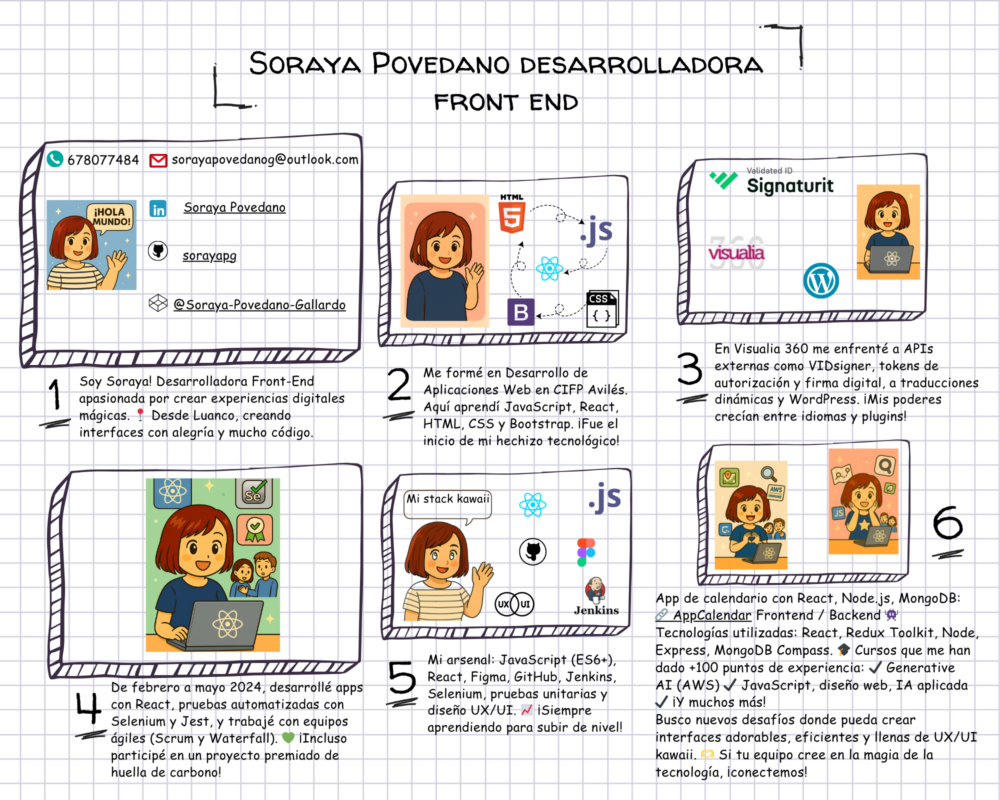
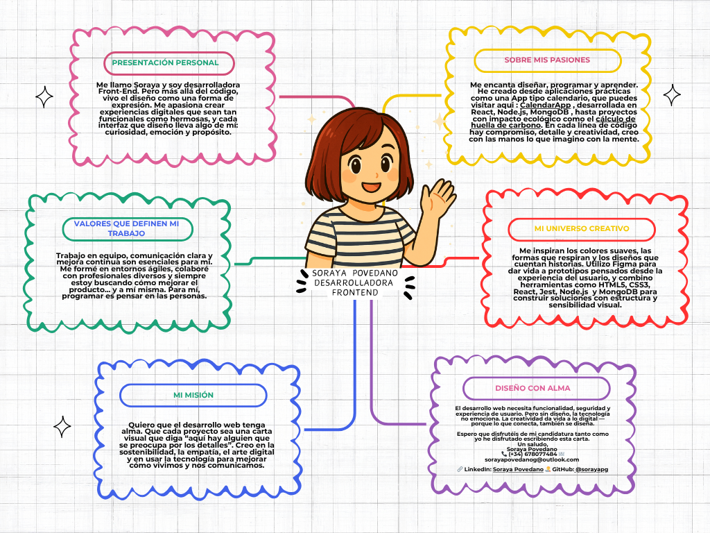

# 🌸 Soraya Povedano — Front-End Developer con alma creativa

¡Hola! Soy Soraya, desarrolladora Front-End junior apasionada por construir **interfaces digitales con corazón y propósito**. Desde Luanco, desarrollo aplicaciones con React, diseño con Figma y pongo mucha magia en cada componente.

Mi enfoque mezcla la funcionalidad con la estética kawaii, la sostenibilidad con el detalle técnico, y el código con una narrativa visual que emociona. 

---

## ✨ Sobre mí

🌈 Diseñadora de experiencias visuales y desarrolladora de soluciones eficientes.  
🧠 Aprendiendo siempre, creciendo siempre.  
💡 Creo firmemente que el desarrollo web puede tener alma.  
💬 Me inspiran los colores suaves, el diseño UX/UI y los equipos que comunican claro.  

> “Para mí, programar es pensar en las personas.”

---

## 🛠️ Stack Técnico

- **Lenguajes**: JavaScript (ES6+), HTML5, CSS3, PHP, SQL  
- **Frameworks y Librerías**: React, Redux Toolkit, Node.js, Express, MongoDB  
- **Pruebas**: Jest, Selenium  
- **Diseño y UX/UI**: Figma, prototipado interactivo  
- **Herramientas**: Git, GitHub, Jenkins, MongoDB Compass, DevOps  
- **Metodologías**: Scrum, Waterfall, CI/CD

---

## 📚 Formación & Cursos

- FP Desarrollo de Aplicaciones Web – CIFP Avilés  
- IA Aplicada a la Empresa – 080 Formación  
- Generative AI Foundations (AWS) – IMMUNE Technology  
- Diseño Web y JS Full – Udemy  
- Publicación de Páginas Web, Construcciones Web – Smartmind

---

## 💼 Experiencia profesional

### 🔹 ** SIMAD Frontend Developer (Arquitectura híbrida PHP / JavaScript) - noviembre 2025 – actualidad ** 
- Desarrollo de componentes frontend desde cero, gestionando el ciclo completo desde la definición hasta la integración con backend.  
- Renderizado dinámico del HTML, con actualización reactiva del DOM en función de cambios en las props y el estado. 
- Diseño de estilos CSS encapsulados, alineados pixel-perfect con los diseños proporcionados en Figma.
- Gestión avanzada de eventos, incluyendo la implementación de listeners, callbacks y control de selección de componentes.
- Comunicación backend-frontend, sincronizando datos mediante actualización de props y manteniendo la consistencia en la interacción con el backend.
- Depuración avanzada utilizando herramientas de desarrollo (Chrome DevTools), análisis de eventos y optimización de rendimiento.

### 🔹 **Visualia 360 (2025)**  
- Integración de APIs como VIDsigner (firma digital).  
- Traducción dinámica multilenguaje con JavaScript.  
- Personalización de sitios con WordPress y pruebas funcionales.

### 🔹 **DXC Technology (2023 – 2024)**  
- Desarrollo de interfaces interactivas con React.  
- Proyecto galardonado de cálculo de huella de carbono.  
- Automatización con Jest y Selenium.  
- Trabajo ágil en equipos multidisciplinares.

---

## 🌐 Proyectos destacados

### 📆 [CalendarApp](https://calendar-app-backend-pro.up.railway.app/auth/login) — Full Stack  
> App de gestión de eventos desarrollada con React, Node.js y MongoDB.  
Incluye login seguro, diseño atractivo y arquitectura backend funcional.  
Tecnologías: `React`, `Node.js`, `MongoDB`, `Express`, `Jest`, `Figma`.

---

### 💖 [Portafolio web](https://soraya-porfolio.web.app/) — Diseño + Código  
> Mi espacio digital donde muestro proyectos, valores y estilo kawaii.  
Animaciones suaves, interfaz amigable y esencia propia.

---

### 🎨 Storyboard Interactivo  
> Una aventura visual que cuenta mi historia como dev.  
Colores pastel, scroll animado y narrativa visual UX.  

---

## 💌 Carta de presentación creativa

Me gusta diseñar lo que imagino, programar lo que visualizo y contar historias a través del código.  
Aquí te comparto visualmente mi carta de presentación, una muestra de diseño y propósito:

---

## 🌱 Valores que definen mi trabajo

- ✨ **Diseño con alma**
- 🔍 **Atención al detalle**
- 🤝 **Colaboración y escucha**
- 🌍 **Tecnología con impacto positivo**
- 💜 **Creatividad como motor**

---

## 📫 Conecta conmigo

- 📧 sorayapovedanog@outlook.com  
- 🧑‍💻 [GitHub: @sorayapg](https://github.com/sorayapg)  
- 🔗 [LinkedIn: Soraya Povedano](https://www.linkedin.com/in/soraya-povedano/)  
- 🌐 [Portafolio](https://soraya-porfolio.web.app/)  

---

> "Si tu equipo cree en la magia de la tecnología, ¡conectemos!"
